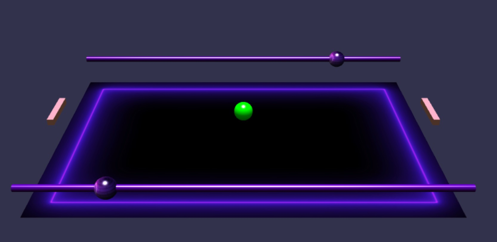

# [3d-pingpong](https://brianrahadi.github.io/3d-pingpong/)
You like 3D graphics? You like ping pong? We got 3D pingpong!

## What is this?
A fun 3D ping-pong game built with Babylon.js library. It lets you to play ping-pong in a more realistic way than a standard 2D ping-pong.

## How to Play?
- Use W and S to control left paddle
- Use I and K to control right paddle
- Use mouse or arrow button to control the camera
- Ball will be resetted if it goes out of the area

## Further Improvements
- Implement score system for the game

## Acknowledgement
- https://www.babylonjs.com/
- My CPSC2130's (Multimedia and Animation) instructor :)
